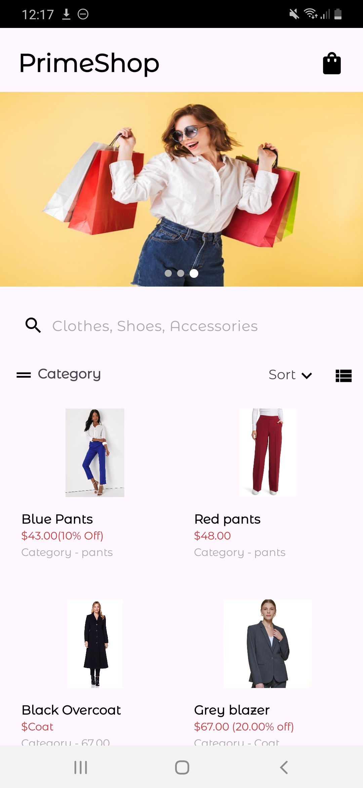
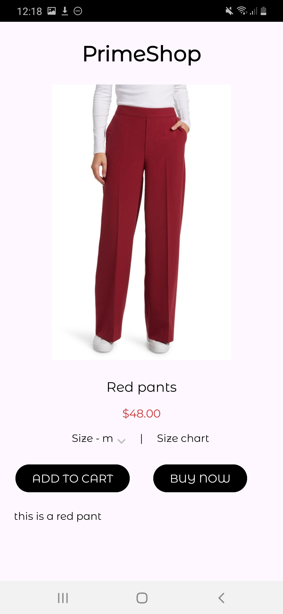
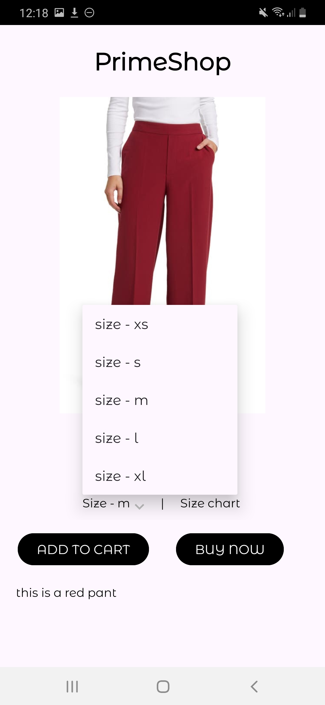
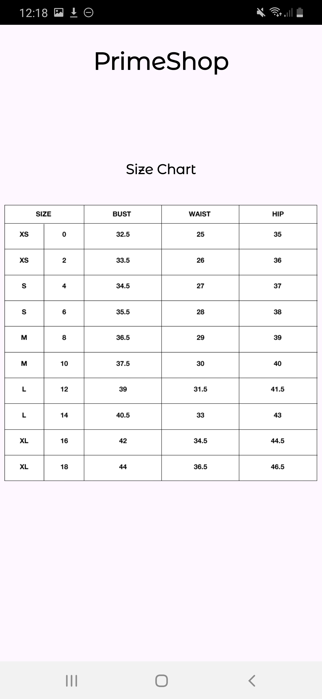
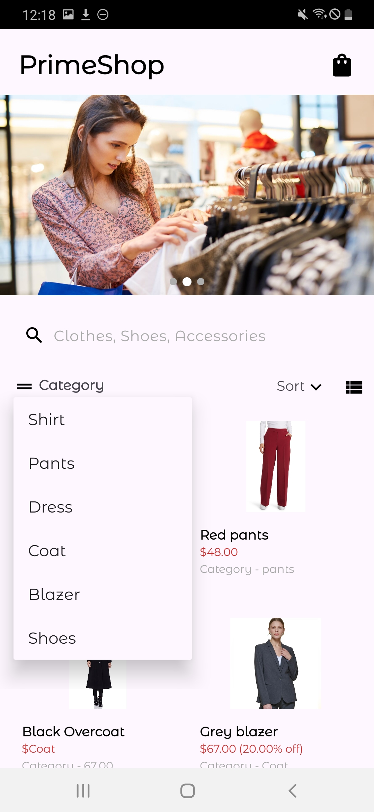
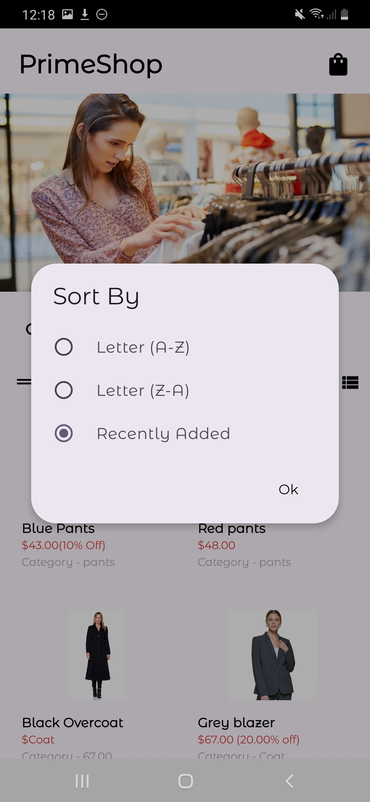
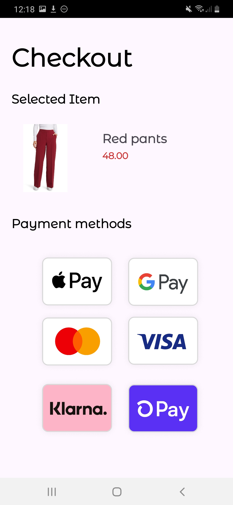

# Prime Shop App

## Project Overview
Prime Shop is a cutting-edge e-commerce platform tailored for fashion enthusiasts. Designed exclusively for Android devices, it offers a sleek and intuitive shopping experience for clothing lovers.

## Key Features
- **Fashion-Focused Product Catalog**: Browse through a curated selection of trendy clothes with detailed descriptions and high-quality images.
- **Seamless Shopping Cart**: Add your favorite outfits to the cart and proceed to checkout with ease.
- **Secure User Authentication**: Protect your style with secure login and registration features.
- **Effortless Payment Integration**: Choose from various payment options to complete your purchase hassle-free.
- **Order History & Tracking**: Keep track of your orders and stay updated on delivery status.
- **Responsive Design**: Enjoy a consistent shopping experience across all Android devices, from phones to tablets.

## Technologies Used
- **Programming Language:** Kotlin
- **Integrated Development Environment (IDE):** Android Studio
- **User Interface (UI) Development:** Android XML Layouts
- **Application Programming Interface (API):** Android SDK
- **Database:** Room Persistence Library
- **Architecture:** MVVM (Model-View-ViewModel)
- **Dependency Injection:** Dagger
- **Build and Dependency Management:** Gradle

## Installation and Usage Instructions
### Prerequisites
- Android Studio installed on your computer.
- A GitHub account.
- An Android device or emulator for testing.

### Steps
1. **Clone the Repository:**
   ```bash
   git clone https://github.com/santhosh62372n/Prime-Shop-App.git
2. **Open the Project in Android Studio:**

- Open Android Studio.
- Click on File > Open and navigate to the cloned repository folder.
- Select the folder and open it in Android Studio.
3. **Build the Project:**

- Android Studio will automatically sync and build the project.
- If there are any build issues, resolve them by following the prompts in Android Studio.
4. **Run the App:**

- Connect your Android device or start an emulator.
- Click on the Run button (green play button) in Android Studio.
- Select your device/emulator and run the app.

## Goals

Our mission is to revolutionize the way you shop for clothes on Android. We strive to provide a platform that not only showcases the latest fashion trends but also ensures a secure and enjoyable shopping journey.
## Screenshots







